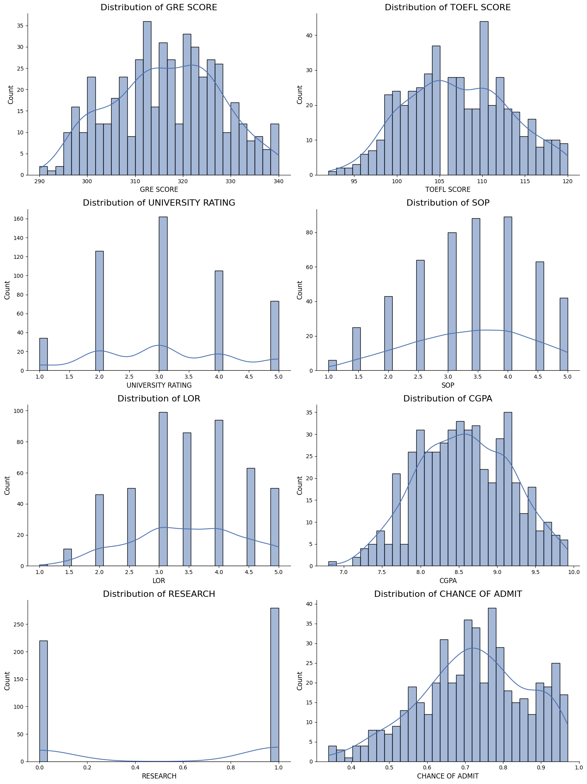
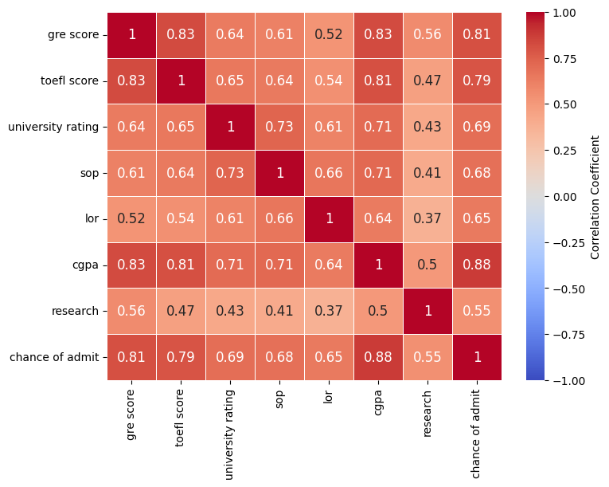

# Jamboree Admission Analysis

## Overview
This project explores and predicts the probability of admissions based on academic and personal factors such as GRE scores, TOEFL scores, CGPA, and research experience. Using data analysis, visualization, and machine learning techniques, it identifies key features influencing admission chances and builds models to provide accurate predictions.

The goal is to help students understand which factors impact admission decisions, enabling them to make informed choices during their application process.

## Table of Contents
- [Overview](#overview)
- [Data](#data)
- [Methodology](#methodology)
  - [1. Data Exploration](#1-data-exploration)
  - [2. Data Visualization](#2-data-visualization)
  - [3. Statistical Analysis](#3-statistical-analysis)
  - [4. Data Preprocessing](#4-data-preprocessing)
  - [5. Model Development](#5-model-development)
- [Results](#results)
- [Acknowledgments](#acknowledgments)

## Data
The dataset contains information about students' academic performance, personal ratings, and other factors influencing admissions. It includes the following features:

- **GRE Score**: 0-340
- **TOEFL Score**: 0-120
- **University Rating**: 1-5 (5 being the highest)
- **SOP (Statement of Purpose)**: Quality rating of the applicant’s SOP (1-5)
- **LOR (Letter of Recommendation)**: Strength rating of the applicant’s recommendation letter (1-5)
- **CGPA**: Undergraduate GPA on a 10-point scale
- **Research**: Binary indicator (0 or 1) of research experience

The dataset is stored as `Jamboree.csv` in the `/data` directory.

## Methodology
The project follows a structured data science approach to ensure a thorough and accurate analysis:

### 1. Data Exploration
- **Objective**: Understand the dataset structure, detect missing values, identify outliers, and examine feature distributions.
- **Steps**:
  - Loaded and examined the dataset.
  - Checked for missing values and data types.
  - Assessed the shape and computed summary statistics.

### 2. Data Visualization
- **Objective**: Explore patterns, distributions, and relationships between variables.
- **Steps**:
  - Created histograms and scatter plots to observe distributions and relationships.
  - Generated a correlation heatmap to highlight strong relationships, such as those between GRE scores, CGPA, and admission probabilities.
- **Key Visuals**:
  - **Histogram**: Showed the distribution of various scores and ratings.  
    
  - **Correlation Heatmap**: Displayed strong correlations between GRE scores, CGPA, and admission probability.  
    

### 3. Statistical Analysis
- **Objective**: Test for statistically significant relationships between variables.
- **Tests**:
  1. **ANOVA Test for University Rating**:
     - Evaluated differences in admission chances across different university ratings.
     - **Result**: Significant difference found (p-value: 7.75e-69), indicating that university rating significantly impacts admission chances.
  2. **Correlation Test for Continuous Variables**:
     - Assessed the relationship between GRE score/CGPA and admission probability.
     - **Results**:
       - GRE Score: Correlation = 0.81 (p-value: 1.09e-117)
       - CGPA: Correlation = 0.88 (p-value: 3.40e-165)
     - **Interpretation**: Both GRE score and CGPA have a strong, statistically significant positive correlation with admission chances.
  3. **Chi-Square Test for Research and University Rating**:
     - Tested the association between research experience and university rating.
     - **Result**: Statistically significant association (p-value: 4.49e-20), indicating that research experience is linked to university ratings.

### 4. Data Preprocessing
- **Objective**: Prepare the data for model training through cleaning and transformation.
- **Steps**:
  - Removed unnecessary columns and handled missing values.
  - Encoded categorical variables (e.g., research experience) and scaled numerical features using Min-Max scaling.
- **Outcome**: Data was cleaned and standardized, ready for model training.

### 5. Model Development
- **Objective**: Train and evaluate machine learning models to predict admission probabilities accurately.
- **Models Developed**:
  - Linear Regression
  - Decision Tree Regressor
  - Random Forest Regressor
  - Support Vector Machine (SVM)
  - Gradient Boosting Regressor
- **Evaluation Metrics**:
  - Mean Absolute Error (MAE)
  - Mean Squared Error (MSE)
  - R² Score
- **Best Model**: The Random Forest Regressor, which provided the highest accuracy and valuable insight into feature importance.

## Results
The table below summarizes the evaluation metrics for each model:

| Model                  | MAE      | MSE      | R²       | Cross-Validation R² |
|-----------------------|----------|----------|----------|---------------------|
| Linear Regression     | 0.043240 | 0.003756 | 0.816311 | 0.789704            |
| Decision Tree         | 0.064000 | 0.008362 | 0.591100 | 0.596425            |
| Random Forest         | 0.046110 | 0.004398 | 0.784935 | 0.777961            |
| Support Vector Machine| 0.067009 | 0.007431 | 0.636647 | 0.652931            |
| Gradient Boosting     | 0.044973 | 0.004331 | 0.788209 | 0.762526            |

- **Interpretation**: The **Random Forest Regressor** achieved high performance with low error rates and a high R² score, making it the most effective model. The results show that both Random Forest and Gradient Boosting provide reliable predictions with strong model performance metrics.

## Acknowledgments
Special thanks to the Jamboree team for providing the dataset and to the open-source community for the tools and libraries used in this project.